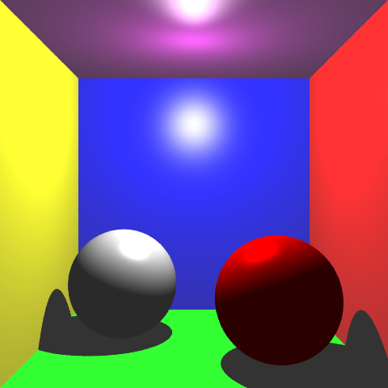
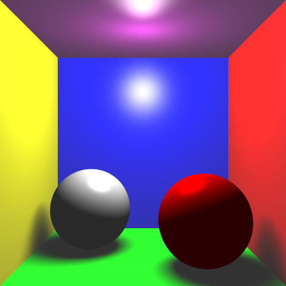
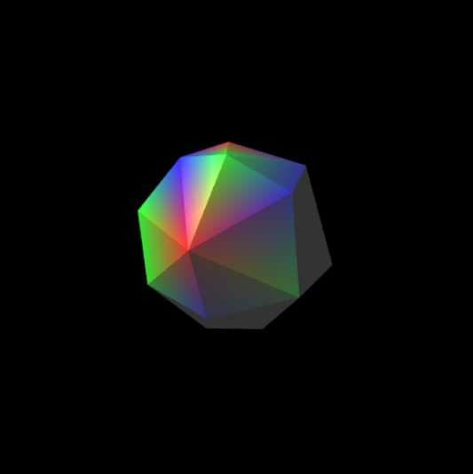
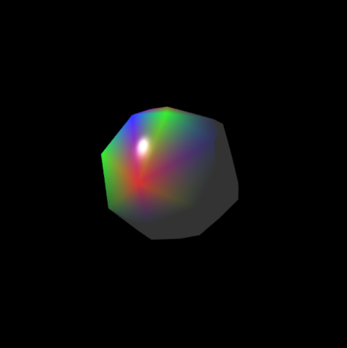
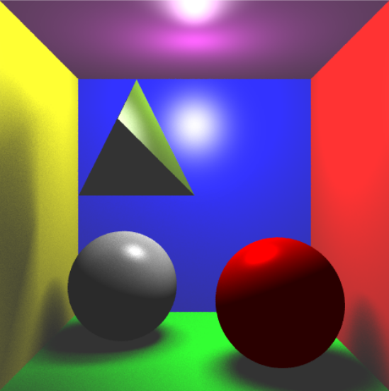
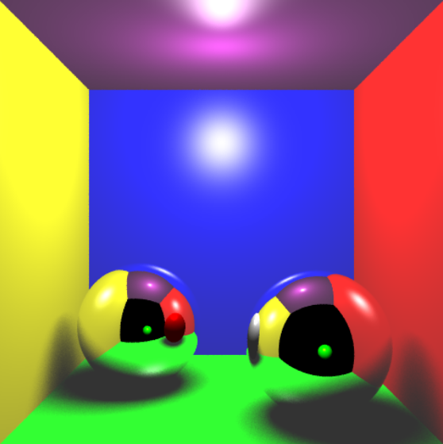
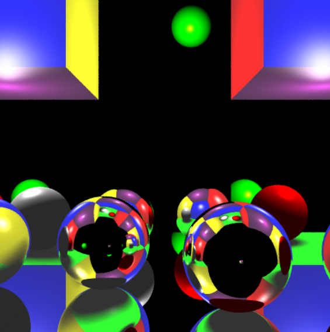
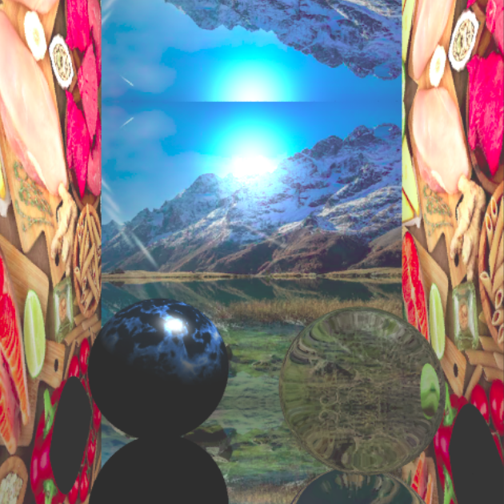
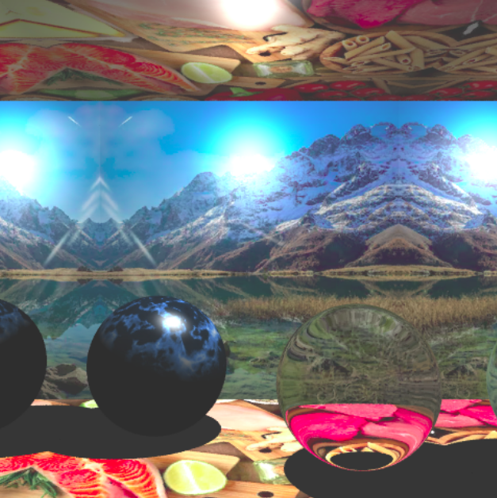
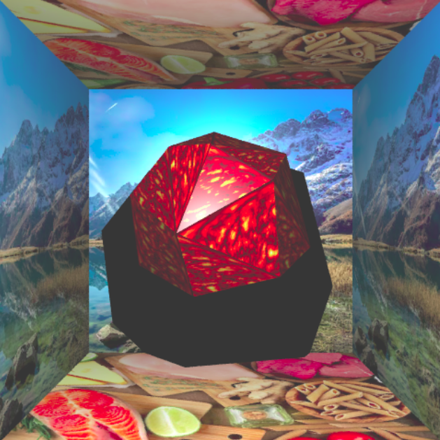

# Projet-Raytracing-M1

### Présentation : ###

Ce projet a été réalisé dans le cadre du cours de programmation 3D du Master Imagine de l'Université de Montpellier. L'objectif était d'implémenter avec le langage **C++** des techniques de lancer de rayons, afin de produire des rendus de scènes 3D. Ces scènes sont construites avec l'application **gMini** (https://github.com/superboubek/gmini) proposée par Tamy Boubekeur, et sont générées avec l'API **OpenGL** et la bibliothèque **GLUT**.
Les fonctionnalités réalisées pour ce projet sont les suivantes :
+ Calcul des intersections entre un rayon et différentes primitives (sphères, plans, triangles), utilisées pour les rendus. 
+ Effets d'ombres (dures ou douces) des objets.
+ Application de textures sur les objets (les fichiers des textures se trouvent dans le répertoire *img*).
+ La prise en charge des triangles permet notamment de faire le rendu de maillages.
+ Effets de réflexion et de réfraction sur les objets (selon les lois de Snell-Descartes).

### Pour démarrer l'application : ###
Pour compiler et exécuter l'application, lancez simplement les commandes suivantes :
```
make 
./main
```

### Liste des commandes :

+ 'f' : Rentrer/sortir du mode plein écran
+ 'w' : Passer l'affichage en mode filaire
+ 'r' : Effectuer le rendu de la scène (celui-ci est sauvegardé dans *rendu.ppm*)
+ '+' : Passer à la scène suivante (les scènes sont définies dans *src/Scene.h*)
+ Clic gauche de la souris: Changer l'orientation de la scène
+ Clic droit de la souris : Déplacer la scène
+ Clic molette de la souris : Zoomer/dézoomer	

### Quelques exemples :

<p align="center">
  
  
</p>

<p align="center">
  
  
</p>

<p align="center">
  
  
</p>

<p align="center">
  
  
</p>

<p align="center">
  
  
</p>
